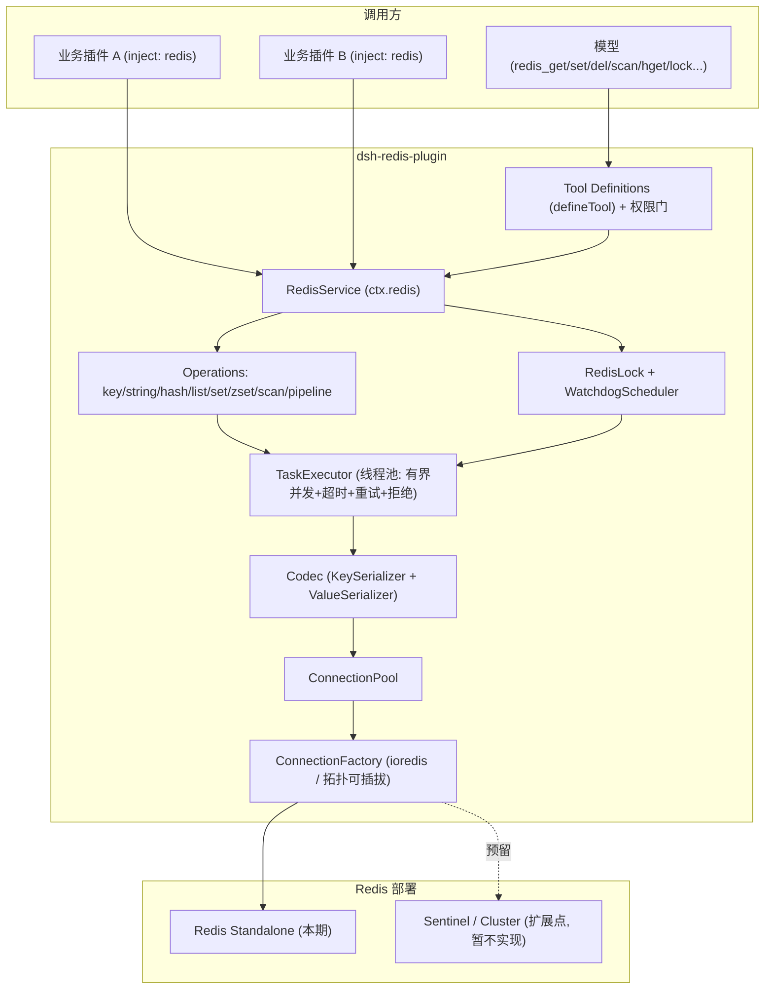

# dsh-redis-plugin 设计方案

> DeepSeek Harness（dsh）Redis 插件 —— 为 dsh 生态提供统一的 Redis 连接、编解码、并发（线程池）与查询能力，并内置分布式锁与看门狗续约。
> 插件既把查询能力**暴露给模型直接调用**，也作为 Cordis 服务 `ctx.redis` 供**其它插件依赖**，完成数据的查询、写入、删除与加锁。
>
> 状态：设计定稿（Design v1）｜语言：TypeScript（ESM）｜运行时：Node.js ≥ 20｜框架：Cordis（dsh vendored）｜Redis 客户端：ioredis

---

## 0. 需求确认（本次定稿依据）

| # | 决策项 | 结论 |
|---|---|---|
| 1 | 插件形态 | **TypeScript / npm 的 dsh 插件**（bundle，声明 `dsh.bundle`） |
| 2 | Redis 客户端 | **ioredis** |
| 3 | 部署拓扑 | **当前仅支持 standalone**，但保留 **sentinel / cluster 扩展点**（工厂层可插拔，本期不实现具体逻辑） |
| 4 | 插件边界 | **将查询能力暴露给模型直接使用**（注册模型可见工具），同时保留 `ctx.redis` 服务供其它插件注入 |
| 5 | 分布式锁 | **必须实现**：分布式锁 + **看门狗自动续约**，避免锁超时导致的并发问题 |

---

## 1. 背景与目标

### 1.1 背景
- `dsh`（DeepSeek Harness）是基于 **Cordis** 的「一切皆插件」Agent 运行时。插件是 npm 包，通过 `package.json` 的 `dsh.bundle` 声明一个配置层（`cordis.patch.yml`），由 `dsh plugin add` 装入某个 profile。
- 插件之间不 `import` 具体实现，而是通过稳定的 **上下文服务键**（`ctx.<key>`）+ `inject` 声明依赖，加载顺序由依赖拓扑决定。
- 生态内目前缺少一个「统一、可复用、带连接治理、且模型可直接使用」的 Redis 能力插件。

### 1.2 目标
1. 提供 **非阻塞** 的 Redis 连接与 **可插拔编解码**（参考 `spring-boot-starter-data-redis-reactive` 的连接/序列化设计）。
2. 提供 **线程池 / 连接池** 治理，避免连接耗尽、命令队头阻塞、事件循环被大对象序列化卡死等「连接问题」。
3. 封装常用 **查询能力**（key/string/hash/list/set/zset/scan/pipeline），API 语义对齐参考实现 `common-utils-3.x/redis-utils`。
4. **把查询能力暴露给模型**：注册模型可见工具（`redis_*`），并对危险操作设置权限边界。
5. 作为 **可被其它插件依赖** 的基础能力：以 Cordis 服务 `ctx.redis` 暴露，同时可作为普通 npm 库被 `import`。
6. 提供 **分布式锁 + 看门狗续约**，保证跨进程/跨插件的互斥安全，规避锁提前过期引发的并发问题。

### 1.3 非目标
- 不做 ORM / 二级缓存框架；不实现 RedisJSON、RediSearch 等模块的高级 DSL（预留扩展点）。
- 本期不实现 sentinel / cluster 的具体连接逻辑（仅保留接口与工厂分支）。
- 不替代 dsh 官方的会话存储；仅作为通用数据面能力。

---

## 2. 技术选型

| 维度 | 选择 | 理由 |
|---|---|---|
| 语言 | TypeScript（ESM，`type: module`） | dsh/Cordis 插件标准形态；严格类型、可逆注册 |
| Redis 客户端 | **ioredis** | 非阻塞（对标 Lettuce/Netty）、原生支持 pipeline、Lua `defineCommand`、pub/sub、阻塞命令；社区成熟；未来可平滑扩展 cluster/sentinel |
| 校验 | `@deepseek-ai/schemastery` | Cordis 官方 Config 校验器，类型与运行时校验合一 |
| 服务模型 | Cordis `Service` / `ctx.provide` / `inject` | 实现「其它插件依赖当前插件」 |
| 工具注册 | `@deepseek-ai/dsh-tools` `defineTool` | 让模型可直接调用 redis 查询（本期核心边界） |
| 测试 | vitest + ioredis-mock / testcontainers | 离线单测 + 真实组合测试 |

> 参考中的 `spring-boot-starter-data-redis-reactive` 是 Java 反应式栈，本插件用 ioredis 在 Node 事件循环上实现等价的「非阻塞 + 连接复用」语义；参考 `redis-utils` 提供 API 语义蓝本。

---

## 3. 总体架构



分层职责：
- **Tool Definitions**：把查询/写入/删除/锁能力包装为模型可见工具，含危险操作权限门。
- **RedisService**：对外唯一门面，挂载到 `ctx.redis`；聚合各操作族与锁。
- **Operations**：按数据类型分组的 API（对齐 `RedisUtils<T>`）。
- **RedisLock / WatchdogScheduler**：分布式锁与自动续约（对齐 `RedisLockUtils` + `RedisLockScheduled`）。
- **TaskExecutor（线程池）**：并发治理、超时、重试、背压、拒绝策略。
- **Codec**：key/value 序列化（对齐 `StringRedisSerializer` / `GenericJackson2JsonRedisSerializer`）。
- **ConnectionPool / ConnectionFactory**：连接创建、复用、健康检查、重连；拓扑可插拔。

---

## 4. 目录结构

```
dsh-redis-plugin/
├── package.json              # 声明 dsh.bundle；peer: @deepseek-ai/cordis；dep: ioredis
├── cordis.patch.yml          # 组合包贡献的配置层（按包名引用插件行）
├── tsconfig.json
├── README.md                 # 服务 API / 事件 / 扩展点 / Model Experience / Known Limitations
├── DESIGN.md                 # 本文档
├── src/
│   ├── index.ts              # 函数插件入口: name/inject/Config/apply
│   ├── service.ts            # RedisService（extends Cordis Service，key='redis'）
│   ├── config.ts             # Config 接口 + schemastery schema
│   ├── types.ts              # 对外类型（TimeUnit/SetOptions/ScanOptions/LockToken...）+ ctx 声明合并
│   ├── connection/
│   │   ├── factory.ts        # ConnectionFactory：standalone 实现 + sentinel/cluster 分支（预留）
│   │   └── pool.ts           # ConnectionPool：连接复用、健康检查、借还、阻塞/pubsub 隔离、优雅关闭
│   ├── codec/
│   │   ├── key.ts            # KeySerializer（string / prefix）
│   │   ├── value.ts          # ValueSerializer（json(+typeHint) / string / raw）
│   │   └── index.ts          # Codec 组合
│   ├── executor/
│   │   ├── task-executor.ts  # 线程池：信号量+队列，core/max/queue/keepAlive/reject/timeout/retry
│   │   └── worker-pool.ts    # 可选：worker_threads 卸载大对象编解码
│   ├── operations/
│   │   ├── key.ts            # del/exists/expire/ttl/type/rename/scan/batchSearch...
│   │   ├── string.ts         # get/set/setEx/setNx/incrBy/multiGet/multiSet...
│   │   ├── hash.ts           # hGet/hSet/hDel/hGetAll/hKeys/hVals/hIncrBy...
│   │   ├── list.ts           # lPush/rPush/lPop/rPop/lRange/lLen...
│   │   ├── set.ts            # sAdd/sMembers/sIsMember/sRem/sCard...
│   │   ├── zset.ts           # zAdd/zRange/zRangeByScore/zScore/zIncrBy/zRem...
│   │   └── pipeline.ts       # 批量/管道
│   ├── lock/
│   │   ├── redis-lock.ts     # tryLock/tryLockWithRetry/withLock/unlock/renew/isHeldByMe
│   │   ├── watchdog.ts       # 续约调度（setInterval，注册为可逆 effect）
│   │   ├── registry.ts       # 本进程持有锁登记（以 token 为键）
│   │   └── scripts.ts        # UNLOCK / RENEW Lua 脚本
│   └── tools/
│       ├── index.ts          # registerRedisTools(ctx, service, options)
│       ├── defs.ts           # 各 redis_* 工具定义（defineTool）
│       └── guard.ts          # 危险操作权限门（tools/pre-execute）
└── test/
    ├── unit/                 # codec / executor / pool / operations / lock（ioredis-mock）
    └── composition/          # 通过 Loader 启动 cordis.yml 的真实组合测试
```

---

## 5. 核心设计

### 5.1 连接层（ConnectionFactory + ConnectionPool）

对标 Spring 的 `RedisConnectionFactory`（Lettuce 非阻塞、连接复用）。

- **ConnectionFactory**：根据 Config 创建 ioredis 实例。
  - **本期实现**：standalone（host/port/password/username/db/tls，或 `url`）。
  - **扩展点（预留，不实现）**：`sentinel`（sentinels/master）、`cluster`（nodes）。工厂用 `switch (topology)` 分支，未实现的分支抛出明确的「暂未支持」错误（fail loud），保证接口稳定、后续可无缝补齐。
  - 关键连接参数：`enableOfflineQueue`、`maxRetriesPerRequest`、`connectTimeout`、`commandTimeout`、`lazyConnect`、`keepAlive`、`enableAutoPipelining`（可选）。
- **ConnectionPool**：
  - 维护 `min ~ max` 条连接；`acquire()/release()` 借还；空闲回收（`idleTimeoutMs`）。
  - **专用连接隔离**：pub/sub、阻塞命令（`BLPOP`/`BRPOP`）从独立连接借出，避免队头阻塞（对标 Lettuce shared vs. dedicated connection）。
  - 健康检查：定期 `PING`；失败连接剔除并重建。
  - 优雅关闭：`dispose()` 时 `quit()` 所有连接，等待在途命令 drain（配合 dsh 关停）。

```ts
export type Topology = 'standalone' | 'sentinel' | 'cluster'

export interface ConnectionFactory {
  readonly topology: Topology
  create(): Promise<IORedis>        // 本期仅 standalone 有实现
}

export interface ConnectionPool {
  acquire(kind?: ConnKind): Promise<PooledConnection>  // kind: 'default' | 'blocking' | 'pubsub'
  release(conn: PooledConnection): void
  stats(): PoolStats                                    // active/idle/waiting
  dispose(): Promise<void>
}
```

### 5.2 编解码层（Codec）

对标 `RedisTemplate` 的序列化器：key 用 `StringRedisSerializer`，value 用 `GenericJackson2JsonRedisSerializer`。

- **KeySerializer**：UTF-8 字符串；可选 `keyPrefix`（命名空间隔离，如 `dsh:{plugin}:`）。
- **ValueSerializer**（可插拔）：
  - `json`（默认）：`JSON.stringify`，可选 **类型提示**（写入 `@type` 字段以还原类型，模仿 Generic Jackson 的 `@class`）；支持 `Map/Set/Date/Buffer` 往返。
  - `string`：纯文本。
  - `raw`：`Buffer`/`Uint8Array` 透传（二进制）。
- 大对象（超过 `offloadThresholdBytes`，默认 1MB）编解码可 **卸载到 worker_threads**，避免阻塞事件循环（见 5.3）。
- **跨语言互通权衡**：`typeHint` 默认关闭以保纯 JSON 互通；仅在需要还原复杂类型时开启。

```ts
export interface ValueSerializer {
  serialize(value: unknown): string | Buffer
  deserialize<T>(raw: string | Buffer): T
}
```

### 5.3 线程池 / 并发治理（TaskExecutor）

对标 `RedisConfig.redisExecutor`（`ThreadPoolTaskExecutor`：corePoolSize/maxPoolSize/queueCapacity/keepAlive/RejectedExecutionHandler）与 `redis-utils` 里 `executePipelined + parallelStream` 的并发批处理。

Node 单线程，「线程池」由三部分组合实现：

1. **有界并发执行器（核心）**：信号量 + 队列。
   - `coreSize` / `maxSize`：并发上限（in-flight 命令数），超过入队。
   - `queueCapacity`：等待队列长度；满时触发 **拒绝策略**。
   - `keepAliveMs`：空闲槽回收。
   - `rejectPolicy`：`abort`（抛错，默认，fail loud）/ `discardOldest` / `callerRuns`（背压到调用方）。
   - `timeoutMs`：单任务超时（AbortSignal 透传到 ioredis 命令）。
   - `retry`：可重试错误（连接抖动/超时）指数退避；**幂等命令白名单**（GET/SET/HGET/EXISTS... 可重试；INCR/LPUSH/SADD 等非幂等默认不重试）。
2. **连接池并行**：executor 从 pool 借连接并行下发命令（对标 `parallelStream`）。
3. **可选 worker_threads 池**：仅用于 CPU 密集的大对象序列化/反序列化。

```ts
export interface TaskExecutor {
  submit<T>(task: (signal: AbortSignal) => Promise<T>, opts?: SubmitOptions): Promise<T>
  submitBatch<T>(tasks: Array<(s: AbortSignal) => Promise<T>>, opts?: SubmitOptions): Promise<T[]>
  metrics(): ExecutorMetrics   // active/queued/completed/rejected/timedOut
  dispose(): Promise<void>
}
```

> 「避免连接问题」的具体手段：命令超时 + 有界并发（防止无限占用连接）+ 拒绝/背压（防雪崩）+ 连接健康检查与自动重连 + 阻塞/pubsub 连接隔离 + 幂等重试。

### 5.4 查询能力封装（RedisService API）

对齐 `RedisUtils<T>` 的方法族（Promise 化、类型化）。核心签名（节选）：

```ts
export interface RedisService {
  // key
  del(key: string | string[]): Promise<number>
  exists(key: string): Promise<boolean>
  expire(key: string, ttl: number, unit?: TimeUnit): Promise<boolean>
  ttl(key: string, unit?: TimeUnit): Promise<number>
  type(key: string): Promise<string>
  rename(oldKey: string, newKey: string): Promise<void>
  scan(options?: ScanOptions): AsyncIterable<string>        // 游标，替代已废弃的 keys()
  batchSearch<T>(prefix: string): Promise<Record<string, T>> // pipeline 批量取值

  // string
  get<T>(key: string): Promise<T | null>
  set(key: string, value: unknown, opts?: SetOptions): Promise<void>  // opts: ex/px/nx/xx
  setEx(key: string, value: unknown, ttl: number, unit?: TimeUnit): Promise<void>
  setIfAbsent(key: string, value: unknown, ttl?: number): Promise<boolean>
  incrBy(key: string, n?: number): Promise<number>
  multiGet<T>(keys: string[]): Promise<Array<T | null>>
  multiSet(map: Record<string, unknown>): Promise<void>

  // hash / list / set / zset（与 RedisUtils 对应）
  hGet/hSet/hDel/hGetAll/hKeys/hVals/hIncrBy ...
  lPush/rPush/lPop/rPop/lRange/lLen ...
  sAdd/sMembers/sIsMember/sRem/sCard ...
  zAdd/zRange/zRangeByScore/zScore/zIncrBy/zRem ...

  // pipeline / 事务
  pipeline(): RedisPipeline
  multi(): RedisTransaction

  // lock（见 5.5）
  readonly lock: RedisLock

  // 治理
  stats(): { pool: PoolStats; executor: ExecutorMetrics }
  dispose(): Promise<void>
}
```

设计要点：
- 所有 API **返回 Promise**（非阻塞），内部经 `TaskExecutor` 调度、`Codec` 编解码、`ConnectionPool` 借连接。
- `scan` 用 **异步迭代器**（游标），禁用 `keys()`（对齐参考里的 `@Deprecated`）。
- `batchSearch` 用 **pipeline** 一次拉取，避免 N 次 RTT。
- `TimeUnit` 提供 `ms/s/m/h/d`，内部统一换算为毫秒（对齐 `convertTimeUnit`）。

### 5.5 分布式锁 + 看门狗（RedisLock + WatchdogScheduler）

对齐 `RedisLockUtils` + `RedisLockScheduled` + `RedisConstants.UNLOCK_SCRIPT`，并针对 Node 单线程模型做适配。

#### 5.5.1 加锁 / 解锁 / 续约（原子性）
- **加锁**：`SET key token NX PX ttl`（原子设置值 + 过期），`token` 为随机 UUID，作为「持有者凭证」。
- **解锁**：Lua 原子脚本（`if get(key)==token then del`），防止误删他人锁（对齐 `UNLOCK_SCRIPT`）。
- **续约**：Lua 原子脚本（`if get(key)==token then pexpire(key, ttl)`），防止续约到已被他人重获的锁。

```lua
-- UNLOCK
if redis.call("get", KEYS[1]) == ARGV[1] then
  return redis.call("del", KEYS[1])
else
  return 0
end

-- RENEW
if redis.call("get", KEYS[1]) == ARGV[1] then
  return redis.call("pexpire", KEYS[1], ARGV[2])
else
  return 0
end
```

#### 5.5.2 看门狗自动续约（避免锁超时导致的并发问题）
- 加锁成功后，将 `{ key, token, ttlMs, nextRenewAt }` 登记到本进程 **LockRegistry**（以 `token` 为键；Node 无线程 id，改用 token + 可选 `AsyncLocalStorage` 关联调用上下文）。
- **WatchdogScheduler**：`setInterval`（默认 `watchdogIntervalMs = 1000ms`）周期扫描登记表：
  - 锁已不存在（被删/过期）→ 从登记表移除。
  - 距过期不足 `renewAheadMs`（默认 10s）→ 触发 Lua 续约，成功后刷新 `nextRenewAt`。
  - 续约失败（锁已易主）→ 记录告警并移除登记，通知持有者（可选回调/事件）。
- **可逆性**：定时器通过 `ctx.effect()` 注册，插件卸载 / HMR / 关停时自动 `clearInterval` 并清空登记表，避免 Java 版静态 Map 的残留问题。
- **进程退出兜底**：`dispose()` 时可选择「主动释放本进程持有的锁」或「依赖 TTL 自然过期」（默认依赖 TTL + 停止续约，避免误删仍在执行的任务锁）。

#### 5.5.3 API

```ts
export interface RedisLock {
  /** 尝试加锁，成功返回 token（并自动登记看门狗续约），失败返回 null */
  tryLock(key: string, ttl?: number, unit?: TimeUnit): Promise<LockToken | null>

  /** 带重试的加锁 */
  tryLockWithRetry(key: string, ttl: number, retryInterval: number, retryCount: number, unit?: TimeUnit): Promise<LockToken | null>

  /** 语法糖：自动加锁 + 执行 fn + finally 释放（执行期间看门狗持续续约） */
  withLock<T>(key: string, fn: () => Promise<T>, opts?: WithLockOptions): Promise<T>

  /** 原子解锁（校验 token） */
  unlock(key: string, token: LockToken): Promise<boolean>

  /** 主动续约一次 */
  renew(key: string, token: LockToken, ttl: number): Promise<boolean>

  /** 锁是否仍由本 token 持有 */
  isHeldByMe(key: string, token: LockToken): Promise<boolean>

  /** 启动/停止看门狗（由 apply 通过 ctx.effect 调用，返回可清理句柄） */
  startWatchdog(): () => void
}

export interface WithLockOptions {
  ttl?: number; unit?: TimeUnit
  retryInterval?: number; retryCount?: number
  onLost?: (key: string) => void     // 续约失败/锁易主回调
}
```

> **并发安全说明**：`withLock` 内部用 `try/finally` 保证释放；看门狗保证长任务不因 TTL 到期而丢锁；Lua 保证解锁/续约只作用于自己持有的锁，从根本上规避「锁超时 → 他人获取 → 原持有者误删/并发写」的经典问题。

---

## 6. 对外契约

采用 Cordis 的 **Service Definition / Provider / Consumer** 缝，本插件同时是 Provider（服务）与 Consumer 载体（工具）。

### 6.1 服务暴露（供其它插件依赖）
本插件在 `apply` 中把 `RedisService` 挂到 `ctx.redis`。其它插件：

```ts
// other-plugin/src/index.ts
import type { Context } from '@deepseek-ai/cordis'
export const name = 'other-plugin'
export const inject = ['redis']            // 声明依赖，loader 保证先加载 redis 插件
export function apply(ctx: Context) {
  const redis = ctx.redis
  ctx.on('ready', async () => {
    await redis.set('user:1', { name: 'ly' }, { ex: 3600 })
    const u = await redis.get('user:1')
    // 分布式锁
    await redis.lock.withLock('order:1001', async () => {
      /* 临界区：安全地读改写 */
    }, { ttl: 30, unit: 's' })
    await redis.del('user:1')
  })
}
```

### 6.2 模型可见工具（本期核心边界）
把查询/写入/删除/锁能力注册为模型可直接调用的工具（`tools.enabled` 控制）：

| 工具 | 说明 | 危险级别 |
|---|---|---|
| `redis_get` | 读取 string/hash/list/set/zset 值 | 只读 |
| `redis_set` | 写入值（支持 TTL） | 写 |
| `redis_del` | 删除单个/多个 key | **危险**（受 `allowDestructive` 控制） |
| `redis_scan` | 按 pattern 游标扫描 key（禁用 keys） | 只读 |
| `redis_exists` / `redis_ttl` / `redis_type` | 元信息查询 | 只读 |
| `redis_hgetall` / `redis_hset` | 哈希读写 | 读 / 写 |
| `redis_incrby` | 计数 | 写 |
| `redis_lock` / `redis_unlock` | 显式加解锁（配合看门狗） | 写 |

工具契约（对齐 dsh `execute()` 规则）：
- 参数经 `defineTool` schema 自动校验；`execute` 只返回**一个规范 JSON 值**（`output.schema`）。
- 遵守 `exec.signal`：信号触发时取消在途命令（透传到 executor/AbortSignal）。
- **权限门**：`allowDestructive=false`（默认）时，`redis_del`、批量删除、`flush*` 等被 `tools/pre-execute` 拦截或降级为「询问」；只读工具默认可用。
- UI 卡片：查询类用 `generic` 卡片展示结果。

### 6.3 库形态复用
本包也可被普通 `import { createRedis } from 'dsh-redis-plugin'` 在非插件环境使用（无 `dsh.bundle` 时仅作依赖，符合官方约定）。

### 6.4 类型共享
`ctx.redis` 类型通过 Cordis **声明合并** 提供给消费方，实现编译期类型安全：

```ts
declare module '@deepseek-ai/cordis' {
  interface Context {
    redis: import('./types').RedisService
  }
}
```

---

## 7. 配置设计（Config / schemastery）

部署期可调，禁止硬编码；经 `cordis.patch.yml` 的插件 `config` 注入。

```ts
export interface Config {
  connection: {
    topology: 'standalone' | 'sentinel' | 'cluster'   // 本期仅 standalone 生效
    url?: string
    host?: string; port?: number; password?: string; username?: string; db?: number
    tls?: boolean | TlsOptions
    // 预留（本期不实现）
    sentinel?: { nodes: string[]; master: string }
    cluster?: { nodes: string[] }
  }
  pool: { min: number; max: number; idleTimeoutMs: number; healthCheckMs: number }
  executor: {                                   // 「线程池」
    coreSize: number; maxSize: number; queueCapacity: number
    keepAliveMs: number; timeoutMs: number
    rejectPolicy: 'abort' | 'discardOldest' | 'callerRuns'
    retry: { maxAttempts: number; backoffMs: number }
  }
  codec: {
    keyPrefix?: string
    value: 'json' | 'string' | 'raw'
    typeHint?: boolean
    offloadThresholdBytes?: number              // 超过则用 worker_threads 编解码
  }
  lock: {
    defaultTtlMs: number
    watchdogIntervalMs: number
    renewAheadMs: number
    releaseOnDispose: boolean                   // 关停时是否主动释放本进程锁（默认 false，依赖 TTL）
  }
  tools: { enabled: boolean; allowDestructive: boolean }
}
```

`cordis.patch.yml`（组合包贡献层，按包名引用）：

```yaml
- id: redis
  name: dsh-redis-plugin
  config:
    connection:
      topology: standalone
      url: !!js "process.env.REDIS_URL ?? 'redis://127.0.0.1:6379'"
    pool: { min: 2, max: 16, idleTimeoutMs: 30000, healthCheckMs: 15000 }
    executor:
      coreSize: 8
      maxSize: 32
      queueCapacity: 1024
      keepAliveMs: 60000
      timeoutMs: 3000
      rejectPolicy: abort
      retry: { maxAttempts: 3, backoffMs: 200 }
    codec: { value: json, typeHint: false, offloadThresholdBytes: 1048576 }
    lock: { defaultTtlMs: 30000, watchdogIntervalMs: 1000, renewAheadMs: 10000, releaseOnDispose: false }
    tools: { enabled: true, allowDestructive: false }
```

`package.json`（bundle 声明，节选）：

```json
{
  "name": "dsh-redis-plugin",
  "version": "0.1.0",
  "type": "module",
  "main": "lib/index.js",
  "types": "lib/types/index.d.ts",
  "files": ["lib", "cordis.patch.yml"],
  "scripts": {
    "build": "tsc -p tsconfig.json && tsdown src/index.ts --out-dir lib",
    "prepare": "pnpm run build"
  },
  "dsh": { "bundle": { "patch": "./cordis.patch.yml" } },
  "peerDependencies": { "@deepseek-ai/cordis": "*" },
  "dependencies": { "ioredis": "^5.4.1" }
}
```

---

## 8. 插件入口与可逆注册（apply 骨架）

```ts
import type { Context } from '@deepseek-ai/cordis'
import z from '@deepseek-ai/schemastery'
import { RedisService } from './service'
import { registerRedisTools } from './tools'

export const name = 'dsh-redis-plugin'
export const inject = []                 // 基础能力，无强依赖
export interface Config { /* 见 §7 */ }
export const Config: z<Config> = z.object({ /* schemastery schema */ })

export function apply(ctx: Context, config: Config) {
  const redis = new RedisService(config)  // 内部创建 factory/pool/codec/executor/lock

  // 1) 暴露为 ctx.redis 服务（供其它插件 inject）
  ctx.provide('redis', redis)

  // 2) 注册模型可见工具（本期核心边界；可逆）
  if (config.tools.enabled) registerRedisTools(ctx, redis, config.tools)

  // 3) 看门狗续约定时器（可逆：卸载/HMR 自动 clearInterval + 清空登记）
  ctx.effect(() => redis.lock.startWatchdog())

  // 4) 优雅关闭：dsh 关停时 drain 连接与在途命令
  ctx.effect(() => () => redis.dispose())

  ctx.logger.info('[dsh-redis-plugin] ready (topology=%s)', config.connection.topology)
}
```

要点（对齐 dsh 规范）：
- **命名导出** `name/inject/Config/apply`，不用默认导出（否则 loader 丢 `inject` 元数据）。
- 所有副作用（定时器、工具注册、连接）都用 `ctx.effect()` / `ctx.on()` 注册，保证 **HMR/卸载可回滚**。
- 配置错误 **fail loud**（加载即报错，不静默跳过）；未支持的拓扑在工厂层显式报错。

---

## 9. 可靠性与异常处理

| 场景 | 策略 |
|---|---|
| 连接抖动 / 短暂不可用 | ioredis 自动重连 + executor 幂等命令退避重试 |
| 命令超时 | `timeoutMs` + AbortSignal 取消，避免连接被长期占用 |
| 并发洪峰 | 有界并发 + 队列 + 拒绝策略（背压），防止连接耗尽 |
| 大对象序列化 | 超阈值卸载 worker_threads，避免阻塞事件循环 |
| 阻塞命令 / pub-sub | 独立连接隔离，防止队头阻塞 |
| 分布式锁提前过期 | **看门狗自动续约** + Lua 原子解锁/续约，规避并发误删 |
| 锁续约失败（易主） | 移除登记 + `onLost` 回调告警，持有者停止写操作 |
| 插件热重载 / 关停 | 可逆 effect 清理定时器与登记；`dispose()` 优雅 `quit()` 并 drain |
| 模型误用危险命令 | 工具权限门（`allowDestructive`）+ `tools/pre-execute` 拦截 |

---

## 10. 测试方案

- **单元测试（离线，ioredis-mock）**：codec 往返、executor 并发/超时/拒绝/重试、pool 借还与健康检查、各操作族。
- **锁专项单测**：加锁互斥、Lua 解锁/续约正确性、看门狗到期续约、锁易主时 `onLost` 触发、`withLock` finally 释放、卸载后定时器清理（HMR 安全）。
- **组合测试（真实 Loader）**：`cordis.yml` 启动，验证 `ctx.redis` 被 provide、其它插件 `inject=['redis']` 能拿到服务、模型工具正确注册与受权限门约束、卸载后连接与定时器回收。
- **集成测试（testcontainers 起真实 Redis）**：pipeline/batchSearch、scan 游标、**多客户端并发抢锁**正确性、长任务续约不掉锁。
- 覆盖率门槛与 dsh 一致；关键路径补 keyless 快照。

---

## 11. 迭代里程碑

| 阶段 | 交付 |
|---|---|
| M1 骨架 | bundle/patch/package.json、Config schema、apply 入口、`ctx.redis` provide、工厂+单连接跑通 get/set/del（standalone） |
| M2 连接治理 | ConnectionPool、TaskExecutor（线程池）、Codec（json/string/raw + typeHint）、超时/重试/拒绝 |
| M3 查询能力 | key/string/hash/list/set/zset/scan/pipeline/batchSearch 全量 API |
| M4 分布式锁 | tryLock/withLock/Lua 解锁与续约/**看门狗**（可逆 effect）/LockRegistry |
| M5 模型工具 | `redis_*` 工具定义 + 权限门、`ctx.redis` 声明合并、示例消费插件、README（含 Model Experience / Known Limitations） |
| M6 质量门与发布 | 单测+锁专项+组合+集成测试、typecheck/lint/build/hygiene、发布（npm / tarball / github） |
| M7 扩展（后续） | sentinel / cluster 拓扑实现；pub-sub、stream 等能力 |

---

## 12. 风险与权衡

- **拓扑范围**：本期仅 standalone，sentinel/cluster 仅在工厂层保留分支与类型；使用方若配置未支持拓扑将 fail loud，避免「看似生效实则未连」。
- **「线程池」语义差异**：Node 无 Java 式线程池，用「有界并发执行器 + 连接池 + worker_threads」组合等价实现，文档需明确其语义，避免误解为 OS 线程。
- **看门狗与进程崩溃**：进程异常退出时看门狗停摆，锁最终由 TTL 自然过期（不会永久死锁）；`releaseOnDispose` 仅处理优雅关停场景。
- **模型工具安全**：默认可读、写/删受控；连接串密码走环境变量，不落盘、不进日志；工具输出避免回显敏感值。
- **跨语言互通**：`typeHint` 开启后 JSON 带 `@type`，与 Java Generic Jackson 的 `@class` 不完全兼容，跨语言共享数据时建议关闭 typeHint。
- **ioredis 适配层**：`ConnectionFactory` 做客户端适配，保留未来切换/升级客户端的可能。
```
